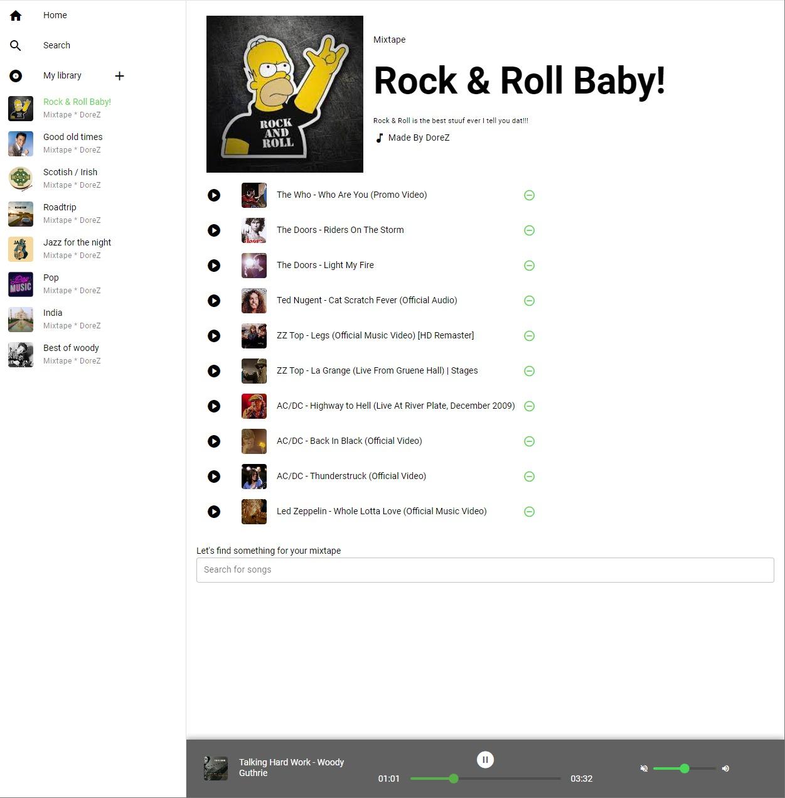

# mixify
  

Mixing humans and music!

Mixify is a music app built with Quasar framework, leveraging its built-in components for rapid development. The app allows users to search for music, create mixtapes, edit them, and play songs. It utilizes the YouTube Player API Reference for iframe Embed and features a manually built media player with song control functionalities.

  
  Try it out [here](https://dorezahavy.github.io/mixify/#/)

  
## Features
* **Mixtape Creation:** Create and edit personalized mixtapes with an intuitive user interface.
* **Music Search:** Easily search for songs using the YouTube API.
* **Songs:** Add or remove songs as desired.
* **Media Player:** Enjoy a custom-built media player that supports complete control of the song and automatic time syncing of the progress bar and timer.
* **Vue3 and Composition API:** Utilizes the latest Vue3 framework with the Composition API for a maintainable code organized to segments of code ordered by logic.
* **Pinia State Management:** Implements Pinia for state management, ensuring a clean and scalable architecture.
* **Image Uploads:** Add images to your mixtapes with ease, utilizing Cloudinary service for seamless web-based image hosting.

